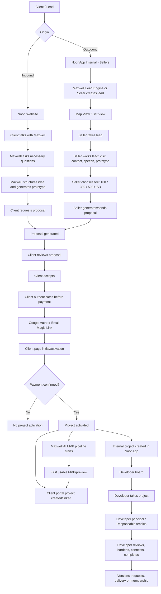
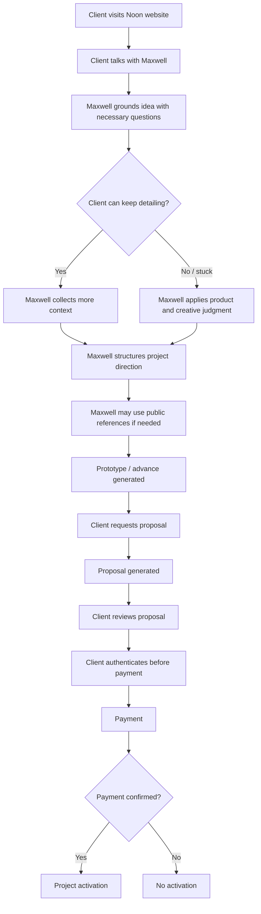
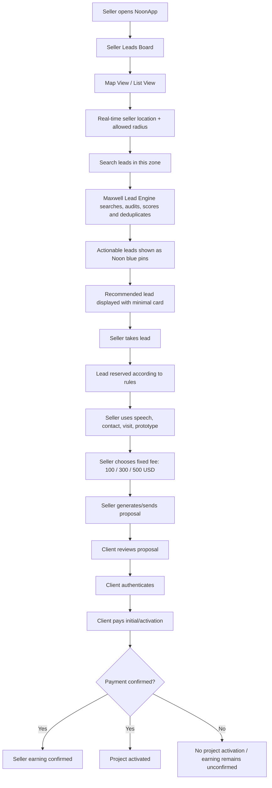
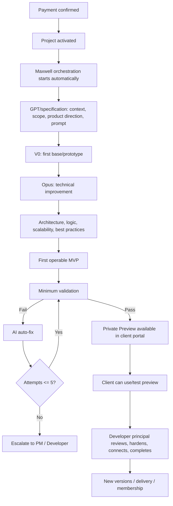
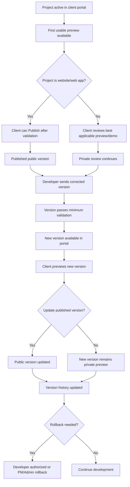
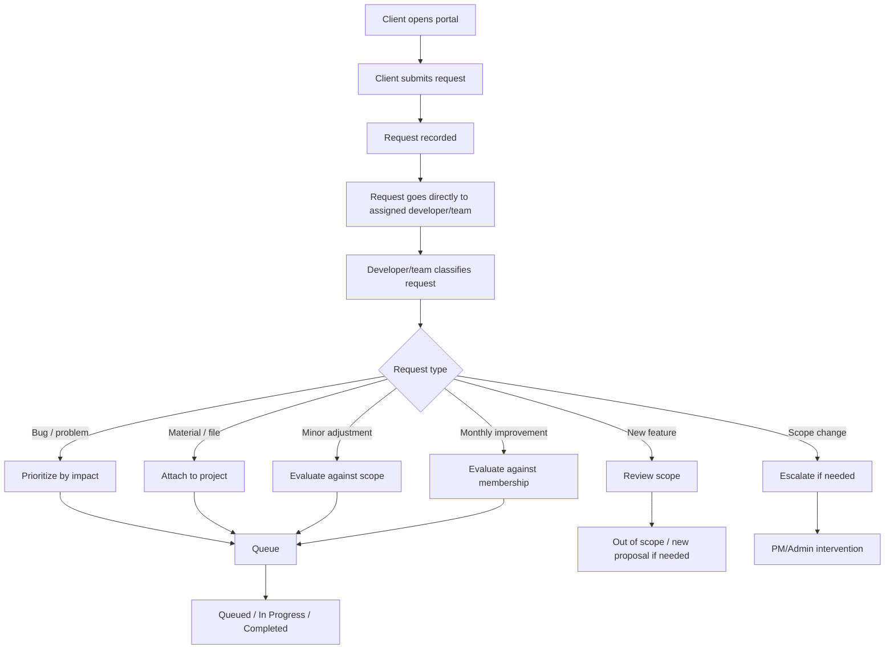
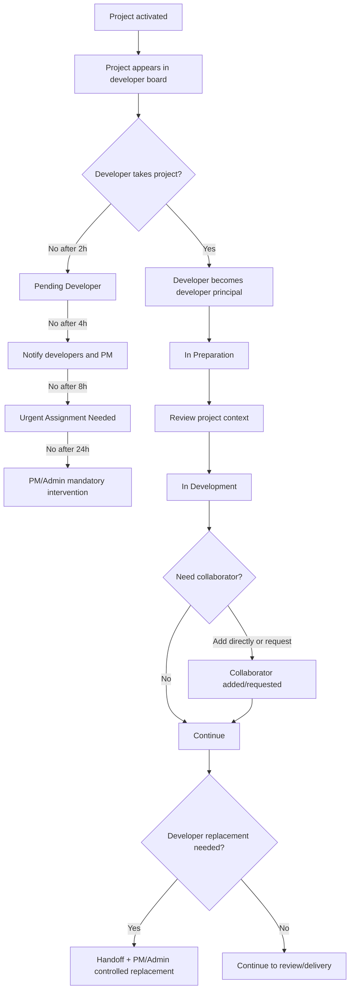
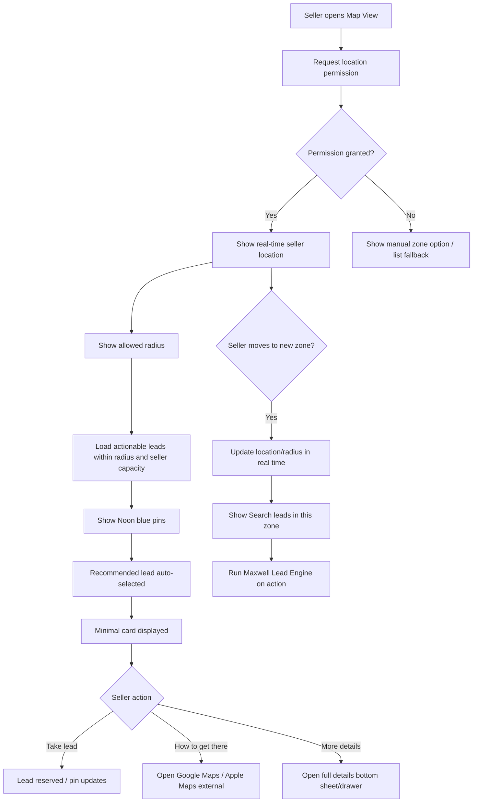
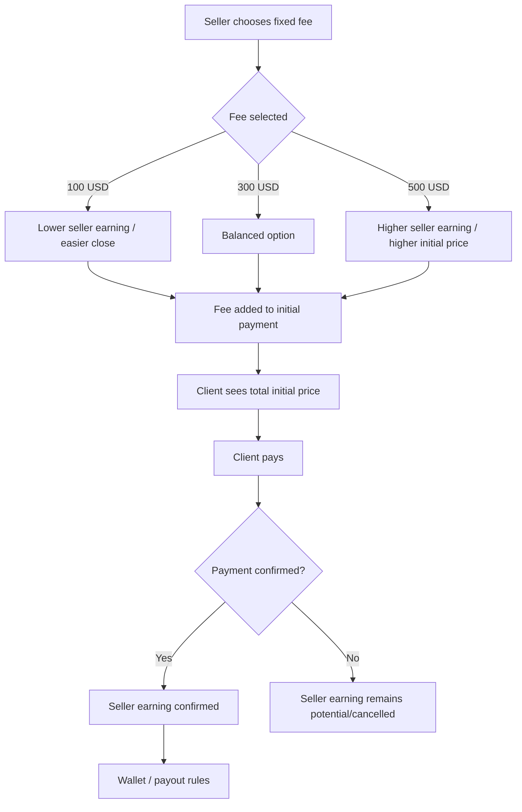

# 1. Purpose

This document contains the updated flow diagrams for the latest NoonApp decisions. It should be used together with the master specification.

Core update:

```text
Maxwell orchestration -> GPT/specification -> V0 base/prototype -> Opus technical improvement -> Developer validation/completion
```

Maxwell is the unified AI orchestration identity of Noon. GPT, V0 and Opus are internal layers/capabilities in the pipeline.

# 2. Macro system flow



# 3. Inbound flow



# 4. Outbound seller flow



# 5. Post-payment Maxwell AI pipeline



# 6. Client portal and versioning flow



# 7. Client request flow



# 8. Developer project responsibility flow



# 9. Seller map flow



# 10. Financial visibility flow for seller fee



# 11. Key flow notes

## 11.1 Publish is not Delivered

```text
Private Preview = client can view/test privately.
Published = client made a web version public.
Delivered = Noon completed and validated approved scope.
```

## 11.2 Client requests do not automatically change scope

```text
All requests enter. Execution depends on plan, scope, membership, capacity and priority.
```

## 11.3 AI does not replace developer

```text
Maxwell/GPT/V0/Opus generate and improve first operable MVP. Developer validates, hardens, connects, scales and completes.
```

## 11.4 Map is not navigation

```text
NoonApp map shows commercial opportunities. Google Maps/Apple Maps handle physical navigation.
```
